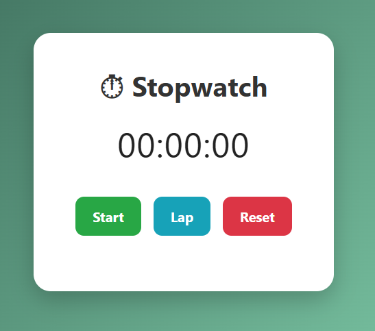

# Stopwatch App ⏱️

A simple, responsive Stopwatch built with ReactJS. It features start, stop, reset, and lap recording functionality with a clean and intuitive interface.

---

## Features

- **Start / Stop** timer control  
- **Reset** the timer to zero  
- **Lap recording** with a list of all lap times  
- Responsive design that works well on desktop and mobile  
- Clean and minimal UI  

---

## Demo

---

## Usage

* Click Start to begin the timer.

* Click Lap to record the current time without stopping the timer.

* Click Stop to pause the timer.

* Click Reset to clear the timer and all laps.

---

## Technologies Used

* ReactJS (Functional components and hooks)

* CSS for styling

---
